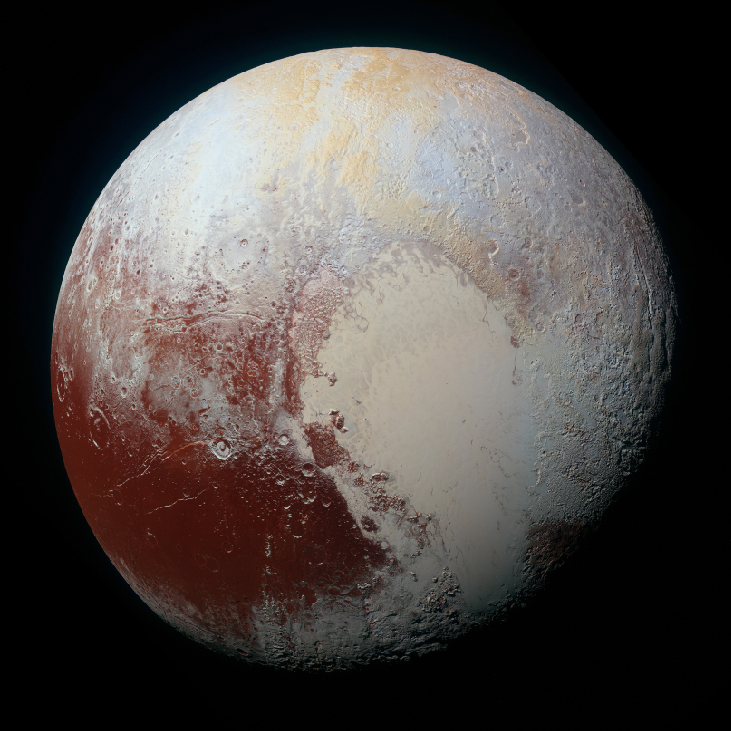

Welcome to *Astronomy*, an OpenStax resource. This textbook was written to increase student access to high-quality learning materials, maintaining highest standards of academic rigor at little to no cost.

# About OpenStax

OpenStax is a nonprofit based at Rice University, and it’s our mission to improve student access to education. Our first openly licensed college textbook was published in 2012 and our library has since scaled to over 20 books for college and AP® courses used by hundreds of thousands of students. Our adaptive learning technology, designed to improve learning outcomes through personalized educational paths, is being piloted in college courses throughout the country. Through our partnerships with philanthropic foundations and our alliance with other educational resource organizations, OpenStax is breaking down the most common barriers to learning and empowering students and instructors to succeed.

# About OpenStax Resources

## Customization

*Astronomy* is licensed under a Creative Commons Attribution 4.0 International (CC BY) license, which means that you can distribute, remix, and build upon the content, as long as you provide attribution to OpenStax and its content contributors.

Because our books are openly licensed, you are free to use the entire book or pick and choose the sections that are most relevant to the needs of your course. Feel free to remix the content by assigning your students certain chapters and sections in your syllabus, in the order that you prefer. You can even provide a direct link in your syllabus to the sections in the web view of your book.

Faculty also have the option of creating a customized version of their OpenStax book through the aerSelect platform. The custom version can be made available to students in low-cost print or digital form through your campus bookstore. Visit your book page on openstax.org for a link to your book on aerSelect.

## Errata

All OpenStax textbooks undergo a rigorous review process. However, like any professional-grade textbook, errors sometimes occur. Since our books are web based, we can make updates periodically when deemed pedagogically necessary. If you have a correction to suggest, submit it through the link on your book page on openstax.org. Subject-matter experts review all errata suggestions. OpenStax is committed to remaining transparent about all updates, so you will also find a list of past errata changes on your book page on openstax.org.

## Format

You can access this textbook for free in web view or PDF through openstax.org, and for a low cost in print.

# About *Astronomy*

*Astronomy* is written in clear non-technical language, with the occasional touch of humor and a wide range of clarifying illustrations. It has many analogies drawn from everyday life to help non-science majors appreciate, on their own terms, what our modern exploration of the universe is revealing. The book can be used for either a one-semester or two-semester introductory course (bear in mind, you can customize your version and include only those chapters or sections you will be teaching.) It is made available free of charge in electronic form (and low cost in printed form) to students around the world. If you have ever thrown up your hands in despair over the spiraling cost of astronomy textbooks, you owe your students a good look at this one.

## Coverage and Scope

*Astronomy* was written, updated, and reviewed by a broad range of astronomers and astronomy educators in a strong community effort. It is designed to meet scope and sequence requirements of introductory astronomy courses nationwide.

* Chapter 1: Science and the Universe: A Brief Tour
* Chapter 2: Observing the Sky: The Birth of Astronomy
* Chapter 3: Orbits and Gravity
* Chapter 4: Earth, Moon, and Sky
* Chapter 5: Radiation and Spectra
* Chapter 6: Astronomical Instruments
* Chapter 7: Other Worlds: An Introduction to the Solar System
* Chapter 8: Earth as a Planet
* Chapter 9: Cratered Worlds
* Chapter 10: Earthlike Planets: Venus and Mars
* Chapter 11: The Giant Planets
* Chapter 12: Rings, Moons, and Pluto
* Chapter 13: Comets and Asteroids: Debris of the Solar System
* Chapter 14: Cosmic Samples and the Origin of the Solar System
* Chapter 15: The Sun: A Garden-Variety Star
* Chapter 16: The Sun: A Nuclear Powerhouse
* Chapter 17: Analyzing Starlight
* Chapter 18: The Stars: A Celestial Census
* Chapter 19: Celestial Distances
* Chapter 20: Between the Stars: Gas and Dust in Space
* Chapter 21: The Birth of Stars and the Discovery of Planets outside the Solar System
* Chapter 22: Stars from Adolescence to Old Age
* Chapter 23: The Death of Stars
* Chapter 24: Black Holes and Curved Spacetime
* Chapter 25: The Milky Way Galaxy
* Chapter 26: Galaxies
* Chapter 27: Active Galaxies, Quasars, and Supermassive Black Holes
* Chapter 28: The Evolution and Distribution of Galaxies
* Chapter 29: The Big Bang
* Chapter 30: Life in the Universe
* Appendix A: How to Study for Your Introductory Astronomy Course
* Appendix B: Astronomy Websites, Pictures, and Apps
* Appendix C: Scientific Notation
* Appendix D: Units Used in Science
* Appendix E: Some Useful Constants for Astronomy
* Appendix F: Physical and Orbital Data for the Planets
* Appendix G: Selected Moons of the Planets
* Appendix H: Upcoming Total Eclipses
* Appendix I: The Nearest Stars, Brown Dwarfs, and White Dwarfs
* Appendix J: The Brightest Twenty Stars
* Appendix K: The Chemical Elements
* Appendix L: The Constellations
* Appendix M: Star Charts and Sky Event Resources

## Currency and Accuracy

*Astronomy* has information and images from the New Horizons exploration of Pluto, the discovery of gravitational waves, the Rosetta Mission to Comet C-G, and many other recent projects in astronomy. The discussion of exoplanets has been updated with recent information—indicating not just individual examples, but trends in what sorts of planets seem to be most common. Black holes receive their own chapter, and the role of supermassive black holes in active galaxies and galaxy evolution is clearly explained. Chapters have been reviewed by subject-matter experts for accuracy and currency.

## Flexibility

Because there are many different ways to teach introductory astronomy, we have made the text as flexible as we could. Math examples are shown in separate sections throughout, so that you can leave out the math or require it as you deem best. Each section of a chapter treats a different aspect of the topic being covered; a number of sections could be omitted in shorter overview courses and can be included where you need more depth. And, as we have already discussed, you can customize the book in a variety of ways that have never been possible in traditional textbooks.

## Student-Centered Focus

This book is written to help students understand the big picture rather than get lost in random factoids to memorize. The language is accessible and inviting. Helpful diagrams and summary tables review and encapsulate the ideas being covered. Each chapter contains interactive group activities you can assign to help students work in teams and pool their knowledge.

## Interactive Online Resources

Interesting “Links to Learning” are scattered throughout the chapters, which direct students to online animations, short videos, or enrichment readings to enhance their learning. Also, the resources listed at the end of each chapter include links to websites and other useful educational videos.

## Feature Boxes That Help Students Think outside the Box

A variety of feature boxes within the chapters connect astronomy to the students’ other subjects and humanize the face of astronomy by highlighting the lives of the men and women who have been key to its progress. Besides the math examples that we’ve already mentioned, the boxes include:

* **Making Connections.** This feature connects the chapter topic to students’ experiences with other fields, from poetry to engineering, popular culture, and natural disasters.
* **Voyagers in Astronomy.** This feature presents brief and engaging biographies of the people behind historically significant discoveries, as well as emerging research.
* **Astronomy Basics.** This feature explains basic science concepts that we often (incorrectly) assume students know from earlier classes.
* **Seeing for Yourself.** This feature provides practical ways that students can make astronomical observations on their own.

## End-of-Chapter Materials to Extend Students’ Learning

* **Chapter Summaries.** Summaries give the gist of each section for easy review.
* **For Further Exploration.** This section offers a list of suggested articles, websites, and videos so students can delve into topics of interest, whether for their own learning, for homework, extra credit, or papers.
* **Review Questions.** Review questions allow students to show you (or themselves) how well they understood the chapter.
* **Thought Questions.** Thought questions help students assess their learning by asking for critical reflection on principles or ideas in the chapter.
* **Figuring For Yourself.** Mathematical questions, using only basic algebra and arithmetic, allow students to apply the math principles given in the example boxes throughout the chapter.
* **Collaborative Group Activities.** This section suggests ideas for group discussion, research, or reports.

## Beautiful Art Program

Our comprehensive art program is designed to enhance students’ understanding of concepts through clear and effective illustrations, diagrams, and photographs. Here are a few examples.

 ![Model of a Pulsar. In this illustration the Earth is drawn below center, in the path of an approaching &#x201C;Beam of particles and radiation&#x201D;. The pulsar, labeled &#x201C;Neutron star&#x201D;, is drawn at upper right as a blue sphere. Its rotation axis is drawn vertically upward, with a counter-clockwise arrow around it indicating the direction of rotation. The magnetic field lines are drawn in a plane perpendicular to the rotation axis as concentric red ellipses on either side of the star. The field lines intersect the surface of the star at the &#x201C;North magnetic pole&#x201D;, which faces Earth, and the &#x201C;South magnetic pole&#x201D;, which faces toward upper right. The beam of radiation is emitted from the poles of the magnetic field, and extend toward upper right and lower left.](../resources/OSC_Astro_23_04_Pulsar.jpg){: #OSC_Astro_23_04_Pulsar data-title="How a Pulsar Beam Sweeps over Earth."}

![Map of the Milky Way Galaxy. Over-plotted on this data-based illustration of the Milky Way is a coordinate system centered on the Sun, which is located about half way from the center and the bottom of the image. It is a polar coordinate system, with zero degrees straight up from the Sun, 90O to the left, 180O straight down and 270O to the right. Distances are shown as circles of increasing radius centered on the Sun. Distances from 15,000 ly to 75,000 ly are indicated in increments of 5,000 ly. Moving outward from the Sun along the zero degree line are the &#x201C;Near 3kpc Arm&#x201D;, &#x201C;Far 3 kpc Arm&#x201D; and the &#x201C;Sagittarius Arm&#x201D;. Moving outward from the Sun along the 330O line (to the right of zero) are the &#x201C;Norma Arm&#x201D; and the &#x201C;Scutum-Centaurus Arm&#x201D;. Moving outward from the Sun along the 90O line are are the: &#x201C;Orion Spur&#x201D;, &#x201C;Perseus Arm&#x201D; and the &#x201C;Outer Arm&#x201D;.](../resources/OSC_Astro_26_02_Milky.jpg){: #OSC_Astro_26_02_Milky data-title="Structure of the Milky Way Galaxy."}

![Illustration of Rift and Subduction Zones. The upper panel shows a rift zone beneath an ocean. At left is a vertical scale of 100 km, from the ocean surface down to the top of the mantle&#x2019;s partially melted zone, which is labeled at the bottom of the diagram. At top center the mid-ocean rift zone is shown, with arrows pointing left and right indicating the direction of plate motion. Directly below the rift zone magma rises up to fill the spaces and cracks between the separating plates, creating mountains and volcanoes. At far right, the thickness of the crust is indicated, consisting of the basalt from the volcanoes and sediment from their erosion. The thickness of the lithosphere is also shown, from the ocean surface down to the top of the mantle&#x2019;s partiallyh melted zone. Finally, at the left and right portions of the illustration the older rocks are labeled, with arrows pointing away from the rift zone. The further from the rift, the older the rocks. The lower panel shows a subduction zone beneath an ocean. At left is a vertical scale of 100 km, from the ocean surface down to the top of the mantle&#x2019;s partially melted zone, which is labeled at the bottom of the diagram. At top center the oceanic trench is labeled. To the right of the trench ocean crust and sediments are indicated, with arrows pointing left showing the motion of the crust toward the trench. At the trench, the ocean crust is forced beneath the continental crust, which is labeled on the left of the diagram. The ocean crust moves down toward the partially melted zone. As it does so, the melting ocean crust becomes hot enough to rise up to the surface (to the left of the trench in this diagram) and create the volcanoes of an island chain. At far right the thickness of the lithosphere is shown, from the ocean surface down to the top of the mantle&#x2019;s partially melted zone.](../resources/OSC_Astro_08_02_RiftZone.jpg){: #OSC_Astro_08_02_RiftZone data-title="Two Aspects of Plate Tectonics."}

{: #OSC_Astro_12_03_GloblPluto data-title="Pluto Close Up."}

# Additional Resources

## Student and Instructor Resources

We’ve compiled additional resources for both students and instructors, including Getting Started Guides, PowerPoint slides, and an instructor answer guide. Instructor resources require a verified instructor account, which can be requested on your openstax.org log-in. Take advantage of these resources to supplement your OpenStax book.

## Partner Resources

OpenStax Partners are our allies in the mission to make high-quality learning materials affordable and accessible to students and instructors everywhere. Their tools integrate seamlessly with our OpenStax titles at a low cost. To access the partner resources for your text, visit your book page on openstax.org.

# About the Authors

## Senior Contributing Authors   {#eip-id1817475}

**Andrew Fraknoi, Foothill College*** * *
{: data-type="newline"}

Andrew Fraknoi is Chair of the Astronomy Department at Foothill College and served as the Executive Director of the Astronomical Society of the Pacific from 1978–1992. His work with the society included editing *Mercury* Magazine, *Universe in the Classroom*, and *Astronomy Beat*. He’s taught at San Francisco State University, Canada College, and the University of California Extension. He is editor/co-author of *The Universe at Your Fingertips 2.0,* a collection of teaching activities, and co-author of *Solar Science,* a book for middle-school teachers. He was co-author of a syndicated newspaper column on astronomy, and appears regularly on local and national radio. With Sidney Wolff, he was founder of *Astronomy Education Review*. He serves on the Board of Trustees of the SETI Institute and on the Lick Observatory Council. In addition, he has organized six national symposia on teaching introductory astronomy. He received the Klumpke-Roberts Prize of the ASP, the Gemant Award of the American Institute of Physics, and the Faraday Award of the NSTA.

**David Morrison, National Aeronautics and Space Administration*** * *
{: data-type="newline"}

 David Morrison is a Senior Scientist at NASA Ames Research Center. He received his PhD in astronomy from Harvard, where he was one of Carl Sagan’s graduate students. He is a founder of the field of astrobiology and is known for research on small bodies in the solar system. He spent 17 years at University of Hawaii’s Institute for Astronomy and the Department of Physics and Astronomy. He was Director of the IRTF at Mauna Kea Observatory. Morrison has held senior NASA positions including Chief of the Ames Space Science Division and founding Director of the Lunar Science Institute. He’s been on science teams for the Voyager, Galileo, and Kepler missions. Morrison received NASA Outstanding Leadership Medals and the NASA Exceptional Achievement Medal. He was awarded the AAS Carl Sagan medal and the ASP Klumpke-Roberts prize. Committed to the struggle against pseudoscience, he serves as Contributing Editor of *Skeptical Inquirer* and on the Advisory Council of the National Center for Science Education.

**Sidney C. Wolff, National Optical Astronomy Observatories (Emeritus)*** * *
{: data-type="newline"}

 After receiving her PhD from the UC Berkeley, Dr. Wolff was involved with the astronomical development of Mauna Kea. In 1984, she became the Director of Kitt Peak National Observatory, and was director of National Optical Astronomy Observatory. Most recently, she led the design and development of the 8.4-meter Large Synoptic Survey Telescope. Dr. Wolff has published over ninety refereed papers on star formation and stellar atmospheres. She has served as President of the AAS and the ASP. Her recently published book, *The Boundless Universe: Astronomy in the New Age of Discovery*, won the 2016 IPPY (Independent Publisher Book Awards) Silver Medal in Science.

All three senior contributing authors have received the Education Prize of the American Astronomical Society and have had an asteroid named after them by the International Astronomical Union. They have worked together on a series of astronomy textbooks over the past two decades.

## Contributing Authors   {#eip-id1172001437164}

John Beck, Stanford University* * *
{: data-type="newline"}

 Susan D. Benecchi, Planetary Science Institute* * *
{: data-type="newline"}

 John Bochanski, Rider University* * *
{: data-type="newline"}

 Howard Bond, Pennsylvania State University, Emeritus, Space Telescope Science Institute* * *
{: data-type="newline"}

 Jennifer Carson, Occidental College* * *
{: data-type="newline"}

 Bryan Dunne, University of Illinois at Urbana-Champaign* * *
{: data-type="newline"}

 Martin Elvis, Harvard-Smithsonian Center for Astrophysics* * *
{: data-type="newline"}

 Debra Fischer, Yale University* * *
{: data-type="newline"}

 Heidi Hammel, Association of Universities for Research in Astronomy* * *
{: data-type="newline"}

 Tori Hoehler, NASA Ames Research Center* * *
{: data-type="newline"}

 Douglas Ingram, Texas Christian University* * *
{: data-type="newline"}

 Steven Kawaler, Iowa State University* * *
{: data-type="newline"}

 Lloyd Knox, University of California, Davis* * *
{: data-type="newline"}

 Mark Krumholz, Australian National University* * *
{: data-type="newline"}

 James Lowenthal, Smith College* * *
{: data-type="newline"}

 Siobahn Morgan, University of Northern Iowa* * *
{: data-type="newline"}

 Daniel Perley, California Institute of Technology* * *
{: data-type="newline"}

 Claire Raftery, National Solar Observatory* * *
{: data-type="newline"}

 Deborah Scherrer, retired, Stanford University* * *
{: data-type="newline"}

 Phillip Scherrer, Stanford University* * *
{: data-type="newline"}

 Sanjoy Som, Blue Marble Space Institute of Science, NASA Ames Research Center* * *
{: data-type="newline"}

 Wes Tobin, Indiana University East* * *
{: data-type="newline"}

 William H. Waller, retired, Tufts University, Rockport (MA) Public Schools* * *
{: data-type="newline"}

 Todd Young, Wayne State College* * *
{: data-type="newline"}

## Reviewers   {#eip-id1171998762180}

Elisabeth R. Adams, Planetary Science Institute* * *
{: data-type="newline"}

 Alfred N. Alaniz, San Antonio College* * *
{: data-type="newline"}

 Charles Allison, Texas A&amp;M University–Kingsville* * *
{: data-type="newline"}

 Douglas Arion, Carthage College* * *
{: data-type="newline"}

 Timothy Barker, Wheaton College* * *
{: data-type="newline"}

 Marshall Bartlett, The Hockaday School* * *
{: data-type="newline"}

 Charles Benesh, Wesleyan College* * *
{: data-type="newline"}

 Gerald B. Cleaver, Baylor University* * *
{: data-type="newline"}

 Kristi Concannon, King’s College* * *
{: data-type="newline"}

 Anthony Crider, Elon University* * *
{: data-type="newline"}

 Scott Engle, Villanova University* * *
{: data-type="newline"}

 Matthew Fillingim, University of California, Berkeley* * *
{: data-type="newline"}

 Robert Fisher, University of Massachusetts, Dartmouth* * *
{: data-type="newline"}

 Carrie Fitzgerald, Montgomery College* * *
{: data-type="newline"}

 Christopher Fuse, Rollins College* * *
{: data-type="newline"}

 Shila Garg, Emeritus, The College of Wooster* * *
{: data-type="newline"}

 Richard Gelderman, Western Kentucky University* * *
{: data-type="newline"}

 Lee Hartman, University of Michigan* * *
{: data-type="newline"}

 Beth Hufnagel, Anne Arundel Community College* * *
{: data-type="newline"}

 Francine Jackson, Brown University* * *
{: data-type="newline"}

 Joseph Jensen, Utah Valley University* * *
{: data-type="newline"}

 John Kielkopf, University of Louisville* * *
{: data-type="newline"}

 James C. Lombardi, Jr., Allegheny College* * *
{: data-type="newline"}

 Amy Lovell, Agnes Scott College* * *
{: data-type="newline"}

 Charles Niederriter, Gustavus Adolphus College* * *
{: data-type="newline"}

 Richard Olenick, University of Dallas* * *
{: data-type="newline"}

 Matthew Olmstead, King’s College* * *
{: data-type="newline"}

 Zoran Pazameta, Eastern Connecticut State University* * *
{: data-type="newline"}

 David Quesada, Saint Thomas University* * *
{: data-type="newline"}

 Valerie A. Rapson, Dudley Observatory* * *
{: data-type="newline"}

 Joseph Ribaudo, Utica College* * *
{: data-type="newline"}

 Dean Richardson, Xavier University of Louisiana* * *
{: data-type="newline"}

 Andrew Rivers, Northwestern University* * *
{: data-type="newline"}

 Marc Sher, College of William &amp; Mary* * *
{: data-type="newline"}

 Christopher Sirola, University of Southern Mississippi* * *
{: data-type="newline"}

 Ran Sivron, Baker University* * *
{: data-type="newline"}

 J. Allyn Smith, Austin Peay State University* * *
{: data-type="newline"}

 Jason Smolinski, Calvin College* * *
{: data-type="newline"}

 Michele Thornley, Bucknell University* * *
{: data-type="newline"}

 Richard Webb, Union College* * *
{: data-type="newline"}

 Terry Willis, Chesapeake College* * *
{: data-type="newline"}

 David Wood, San Antonio College* * *
{: data-type="newline"}

 Jeremy Wood, Hazard Community and Technical College* * *
{: data-type="newline"}

 Jared Workman, Colorado Mesa University* * *
{: data-type="newline"}

 Kaisa E. Young, Nicholls State University* * *
{: data-type="newline"}

